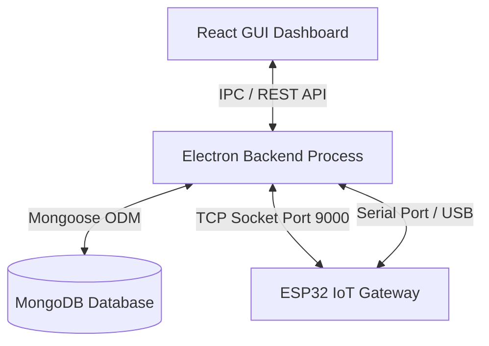

# IoT Monitor & Gateway Registry System

This repository contains the complete codebase for the **IoT Monitor & Gateway Management System**. It integrates a MERN-style desktop and web application with custom ESP32 IoT firmware to monitor telemetry, registry configurations, and run physical diagnostic test routines.

---

## 1. Architecture Overview

The system consists of three main components:
1. **React Frontend (Dashboard)**: Provides user control for tracking live telemetry logs, managing the device configuration registry, triggers remote commands, and views real-time diagnostic reports.
2. **Electron App (Backend Service)**: Runs an Express server hosting the MERN REST API, establishes connections to MongoDB, manages a background data worker, and maintains raw TCP sockets (on Port `9000`) and Serial channels to IoT gateways.
3. **ESP32 IoT Gateway (Firmware)**: Operates a dual-mode wireless access point, streams state-driven JSON telemetry packets, parses remote configuration directives, and executes physical board-level diagnostic routines.



---

## 2. MongoDB Schema & Configuration

All device profiles and telemetry histories are managed in MongoDB using Mongoose schemas defined in [`database.js`](file:///a:/Coding/Electron/IOT_Monitor_System/database.js).

### Device Registry Profile Schema (`DeviceIdentification`)
Represents the target configuration for a given gateway uniquely identified by its IMEI:
*   `imei` (String, required, unique): The 15-digit International Mobile Equipment Identity.
*   `pcbNumber` (String): Board revision or identifier.
*   `password` (String): Secure administration password.
*   `routerSSID` (String): Target Wi-Fi SSID for network routing.
*   `routerPassword` (String): Wi-Fi Passphrase.
*   `telemetryInterval` (Number): Pacing frequency in milliseconds (100ms - 10000ms).
*   `registeredAt` (Date): Registration timestamp.

---

## 3. Express MERN API Routing Endpoints

The backend Express app (configured in [`main.js`](file:///a:/Coding/Electron/IOT_Monitor_System/main.js)) exposes the following REST API endpoints:

### Database & Device Management API
| Method | Endpoint | Description | Payload Example |
| :--- | :--- | :--- | :--- |
| **GET** | `/api/devices` | Returns a list of all registered device configuration profiles. | N/A |
| **GET** | `/api/devices/:imei` | Returns the profile configuration for a specific IMEI. | N/A |
| **POST** | `/api/devices/register` | Creates or updates a device configuration profile. | `{"imei": "8667...", "routerSSID": "HomeWiFi", ...}` |
| **DELETE** | `/api/devices/:imei` | Removes a device profile from the database. | N/A |
| **POST** | `/api/database/connect` | Triggers a live Mongoose database reconnection with a custom URI. | `{"uri": "mongodb://localhost:27017/registry"}` |

### Gateway Command Interfacing
| Method | Endpoint | Description | Payload Example |
| :--- | :--- | :--- | :--- |
| **POST** | `/api/command` | Routes administrative commands directly to active TCP/Serial gateways. | `{"command": "TEST_RS232"}` |

---

## 4. Automated Configuration Synchronization (Auto-Sync)

When an online ESP32 gateway boots or establishes a socket connection, it dispatches a `BOOT_SUCCESS` payload containing its current hardware configurations (SSID, password, interval).

The backend automatically intercepts this payload:
1. It queries MongoDB for a registered profile matching the incoming `deviceIMEI`.
2. If no record exists, it registers the device with its current boot settings.
3. If a record is found, it performs a field-by-field validation check. If database settings differ from current boot values, the backend triggers automated config push commands:
    *   **Password Mismatch**: Sends `SET_PASS:[db_password]`
    *   **SSID/Password Mismatch**: Sends `SET_WIFI:[db_ssid]:[db_password]`
    *   **Telemetry Interval Mismatch**: Sends `SET_INTERVAL:[db_interval]`
4. If Wi-Fi or Passwords are changed, the backend dispatches a final `REBOOT` command to apply settings permanently.

---

## 5. ESP32 Board Diagnostics & Pin Mapping

The gateway firmware ([`firmware.ino`](file:///a:/Coding/Electron/IOT_Monitor_System/firmware/firmware/firmware.ino)) conducts real physical tests. If physical loops or chips are missing, it gracefully writes a Warning / Success log fallback to prevent lockups.

### Pin Configurations

| Peripheral / Interface | Pin Definition | Hardware Description |
| :--- | :--- | :--- |
| **Mode Select A0_1** | GPIO `36` | HIGH: RS232, LOW: RS485 |
| **Mode Select A1_1** | GPIO `37` | Set to HIGH for RS232; LOW for RS485 |
| **GSM Power (PWRKEY)** | GPIO `5` | Pulse pin to boot/shutdown SIM module |
| **GSM Enable (GSM_EN)** | GPIO `21` | Pull HIGH to power up SIM transceiver |
| **Digital Input 1 (DI1)** | GPIO `38` | Optocoupler Input 1 |
| **Digital Input 2 (DI2)** | GPIO `39` | Optocoupler Input 2 |
| **Digital Input 3 (DI3)** | GPIO `40` | Optocoupler Input 3 |
| **Digital Input 4 (DI4)** | GPIO `41` | Optocoupler Input 4 |
| **Digital Input 5 (DI5)** | GPIO `42` | Optocoupler Input 5 |
| **Winbond CS** | GPIO `10` | SPI Chip Select |
| **Winbond SCK** | GPIO `12` | SPI Clock |
| **Winbond MISO** | GPIO `11` | SPI Master In Slave Out |
| **Winbond MOSI** | GPIO `13` | SPI Master Out Slave In |
| **RTC SDA / SCL** | Pins `33` / `32` | Standard I2C pair (Fallback: `22` / `23`) |

---

## 6. Physical Diagnostics Specifications

### 1. RS232 Loopback
*   **Action**: Sets `A0_1` and `A1_1` to `HIGH`. Starts `Serial2` on pins `14` (RX) and `15` (TX) at 9600 baud.
*   **Logic**: Sends `"RS232_TEST"` string and verifies if the exact payload is read back.

### 2. RS485 Differential
*   **Action**: Sets `A0_1` and `A1_1` to `LOW`. Starts `Serial2` on pins `18` (RX) and `17` (TX) at 9600 baud.
*   **Logic**: Transmits `"RS485_TEST"` and verifies loopback return.

### 3. GSM SIM Transceiver
*   **Action**: Sets `GSM_EN` high and pulses `GSM_PWRKEY`.
*   **Logic**: Temporarily shifts `Serial1` to pins `1` (RX) and `2` (TX) at 115200 baud, dispatches `AT\r\n` command, and validates `OK` response. Restores QCOM Serial1 on pins `16`/`17` immediately after testing.

### 4. Winbond Flash Storage
*   **Action**: Configures standard SPI on `HSPI` bus (pins 10, 12, 11, 13).
*   **Logic**: Asserts `CS` low, transfers JEDEC query command `0x9F`, reads 3 identification bytes, verifies Manufacturer ID matches Winbond (`0xEF`), and asserts `CS` high.

### 5. DS3231 RTC Module
*   **Action**: Scans standard I2C channels.
*   **Logic**: Probes address `0x68` on primary pin pair `33`/`32`. If unsuccessful, it attempts a fallback scan on standard pins `22`/`23`.

### 6. Digital Inputs
*   **Action**: Pulls pins `38` to `42` to `INPUT_PULLUP`.
*   **Logic**: Log state values.

---

## 7. How to Run Locally

### Electron Dashboard
1. Open the project directory:
   ```bash
   npm install
   npm run dev
   ```
2. Navigate to **MongoDB Configurations** inside the dashboard settings to verify/connect your DB.

### ESP32 Gateway Compilation
1. Load `firmware/firmware/firmware.ino` in Arduino IDE.
2. Select target board: `ESP32 Dev Module`.
3. Verify that dependencies (`SPI`, `Wire`, `WiFi`, `WebServer`, `Update`) are resolved.
4. Compile and upload binary to the target gateway board.
