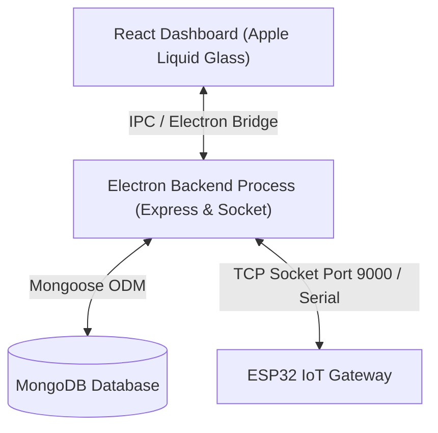

# 🖥️ IoT Monitor & Gateway Registry System

This repository contains the complete codebase for the **IoT Monitor & Gateway Management System**. It integrates an Electron-based desktop application (using a premium **Apple Liquid Glass** design) with custom ESP32 IoT firmware to monitor telemetry, manage registry configurations, and run physical diagnostic test routines.

---

## 📸 Dashboard Preview


> [!NOTE]
> The GUI is designed with an **Apple Liquid Glass** aesthetic: frosted glassmorphic cards with ultra-thin borders (`rgba(255, 255, 255, 0.09)`), deep slate-grey gradients (`#090b11`), backdrop blurring (`25px`), soft drop shadows, and subtle iOS-style color accents (active blue `#0a84ff` and forest green `#30d158`). Active page transitions feature a fluid slide-up entry animation.

---

## 1. Architecture Overview

The system consists of three main components:
1. **React Frontend (Dashboard)**: Desktop control panel for tracking telemetry, managing profiles, triggering updates, and viewing diagnostic checklist reports.
2. **Electron App (Backend Process)**: Host application running an Express REST API, a background telemetry log processor, and raw TCP socket servers (Port `9000`) / Serial channels to communicate with gateways.
3. **ESP32 IoT Gateway (Firmware)**: Handles wireless connectivity, streams telemetry JSON packets, processes remote configurations, and runs low-level hardware test loops.


```mermaid
graph TD
    A["React Dashboard (Apple Liquid Glass)"] <-->|IPC / Electron Bridge| B["Electron Backend Process (Express & Socket)"]
    B <-->|Mongoose ODM| C[("MongoDB Database")]
    B <-->|TCP Socket Port 9000 / Serial| D["ESP32 IoT Gateway"]
```

---

## 2. MongoDB Schema & Configuration

All device profiles and telemetry histories are managed in MongoDB using Mongoose schemas defined in [`database.js`](file:///a:/Coding/Electron/IOT_Monitor_System/database.js).

### Device Registry Profile Schema (`DeviceIdentification`)
Represents the target configuration for a given gateway uniquely identified by its IMEI:
*   `imei` (String, required, unique): The 15-digit International Mobile Equipment Identity.
*   `pcbNumber` (String): Board revision or identifier.
*   `password` (String): Secure administration password.
*   `routerSSID` (String): Target Wi-Fi SSID for network routing.
*   `routerPassword` (String): Wi-Fi Passphrase.
*   `telemetryInterval` (Number): Pacing frequency in milliseconds (100ms - 10000ms).
*   `registeredAt` (Date): Registration timestamp.

---

## 3. Express REST API Routing

The backend Express server (configured in [`main.js`](file:///a:/Coding/Electron/IOT_Monitor_System/main.js)) exposes the following REST API endpoints:

### Database & Device Management API
| Method | Endpoint | Description | Payload Example |
| :--- | :--- | :--- | :--- |
| **GET** | `/api/devices` | Returns a list of all registered device configuration profiles. | N/A |
| **GET** | `/api/devices/:imei` | Returns the profile configuration for a specific IMEI. | N/A |
| **POST** | `/api/devices/register` | Creates or updates a device configuration profile. | `{"imei": "8667...", "routerSSID": "HomeWiFi", ...}` |
| **DELETE** | `/api/devices/:imei` | Removes a device profile from the database. | N/A |
| **POST** | `/api/database/connect` | Triggers a live Mongoose database reconnection with a custom URI. | `{"uri": "mongodb://localhost:27017/registry"}` |

### Gateway Command Interfacing
| Method | Endpoint | Description | Payload Example |
| :--- | :--- | :--- | :--- |
| **POST** | `/api/command` | Routes administrative commands directly to active TCP/Serial gateways. | `{"command": "TEST_RS232"}` |

---

## 4. Hardware Pin Mapping & Diagnostics

The gateway firmware ([`firmware.ino`](file:///a:/Coding/Electron/IOT_Monitor_System/firmware/firmware/firmware.ino)) conducts real-time physical tests.

### Pin Configurations

| Peripheral / Interface | Pin Definition | Hardware Description |
| :--- | :--- | :--- |
| **Mode Select A0_1** | GPIO `36` | HIGH: RS232, LOW: RS485 |
| **Mode Select A1_1** | GPIO `37` | Set to HIGH for RS232; LOW for RS485 |
| **GSM Power (PWRKEY)** | GPIO `5` | Pulse pin to boot/shutdown SIM module |
| **GSM Enable (GSM_EN)** | GPIO `21` | Pull HIGH to power up SIM transceiver |
| **Digital Input 1 (DI1)** | GPIO `39` | Optocoupler Input 1 (Active HIGH) |
| **Digital Input 2 (DI2)** | GPIO `40` | Optocoupler Input 2 (Active HIGH) |
| **Digital Input 3 (DI3)** | GPIO `41` | Optocoupler Input 3 (Active HIGH) |
| **Digital Input 4 (DI4)** | GPIO `42` | Optocoupler Input 4 (Active HIGH) |
| **Tester Switch (SW)** | GPIO `38` | Manual Tester Switch (Active LOW / INPUT_PULLUP) |
| **Winbond CS** | GPIO `10` | SPI Chip Select |
| **Winbond SCK** | GPIO `12` | SPI Clock |
| **Winbond MISO** | GPIO `11` | SPI Master In Slave Out |
| **Winbond MOSI** | GPIO `13` | SPI Master Out Slave In |
| **RTC SDA / SCL** | Pins `33` / `32` | Standard I2C pair (Fallback: `22` / `23`) |

---

## 5. Physical Diagnostics Specifications

### 1. RS232 Loopback Test
*   **Action**: Sets `MUX_A0` HIGH and `MUX_A1` LOW. Temporarily releases the co-processor serial interface (`Serial1.end()`) to avoid pin contention, then starts `Serial2` on pins `18` (RX) and `17` (TX) at 9600 baud.
*   **Verification**: Runs a **10-second continuous loop** sending `"RS232_TEST\r\n"` and reading loopback data. This causes the physical TX/RX LEDs to flash continuously for 10 seconds. Requires an 80% success rate to pass. Restores the co-processor UART on `17`/`18` immediately after.

### 2. RS485 Loopback Test
*   **Action**: Sets `MUX_A0` LOW and `MUX_A1` LOW. Temporarily releases the co-processor serial interface (`Serial1.end()`), then starts `Serial2` on pins `18` (RX) and `17` (TX) at 9600 baud.
*   **Verification**: Runs a **10-second continuous loop** sending `"RS485_TEST\n"`. This flashes the transceiver LEDs for visual verification. Requires an 80% success rate to pass. Restores the co-processor UART on `17`/`18` immediately after.

### 3. Digital Inputs & Momentary Switches
*   **Action**: Pulls DI pins `39` to `42` to `INPUT_PULLDOWN`. Reads `HIGH` when active/shorted (Active-HIGH logic). Configures Pin `38` as `INPUT_PULLUP` to monitor the physical tester switch.
*   **GUI Simulation**: Toggling the **Momentary Push Buttons** in the React dashboard simulates a short circuit by lighting the pin indicator green while held down (momentary touch/click mechanics).

### 4. GSM SIM Transceiver
*   **Action**: Sets `GSM_EN` high and pulses `GSM_PWRKEY`.
*   **Logic**: Temporarily shifts `Serial1` to pins `1` (RX) and `2` (TX) at 115200 baud, dispatches `AT\r\n` command, and validates `OK` response. Restores QCOM Serial1 on pins `17`/`18` immediately after testing.

### 5. Winbond Flash Storage
*   **Action**: Configures SPI on `HSPI` bus (pins 10, 12, 11, 13).
*   **Logic**: Asserts `CS` low, transfers JEDEC query command `0x9F`, reads 3 identification bytes, verifies Manufacturer ID matches Winbond (`0xEF`), and asserts `CS` high.

### 6. DS3231 RTC Module
*   **Action**: Scans standard I2C channels.
*   **Logic**: Probes address `0x68` on primary pin pair `33`/`32`. If unsuccessful, it attempts a fallback scan on standard pins `22`/`23`.

---

## 6. How to Run Locally

### Electron Dashboard
1. Install dependencies and start the app:
   ```bash
   npm install
   npm run dev
   ```
2. Navigate to **MongoDB Configurations** inside the dashboard settings to verify/connect your database.

### ESP32 Gateway Compilation
1. Load `firmware/firmware/firmware.ino` in Arduino IDE or compile via CLI.
2. Select target board: `ESP32S3 Dev Module` (or standard `ESP32 Dev Module`).
3. Compile and upload binary to the target gateway board:
   ```bash
   arduino-cli compile --fqbn esp32:esp32:esp32s3 firmware.ino
   ```
